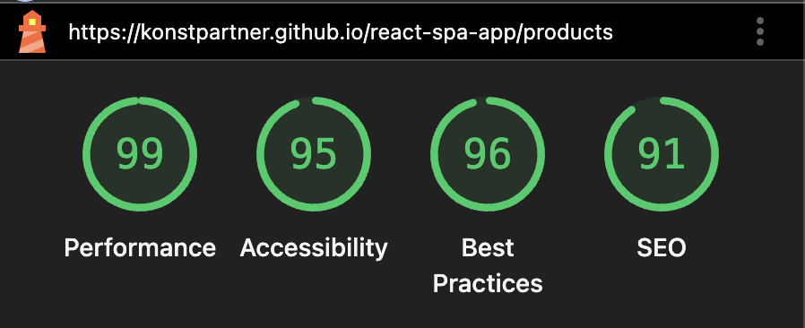

# React SPA App

A single-page e-commerce application built with **React** and typescript, providing product browsing, cart management, and detailed product views.

Live Demo: https://konstpartner.github.io/react-spa-app/

---

## Functionality

- Fetch and display a **list of products** from a public API
- View **detailed information** for each product
- **Add**, **update**, and **remove** items from the cart
- View the **cart page** with all selected items
- **Routing** implemented using **React Router**
- **State management** handled with **Redux Toolkit**
- **Data fetching and caching** via **RTK Query**
- **User interface** built with **Mantine UI**
- Fully **responsive layout** for mobile and desktop devices

---

## Core Dependencies

- React
- React Router DOM
- Redux Toolkit & RTK Query
- Mantine Core & Hooks
- Lucide React (icons)
- TypeScript
- Vite

---

## Project Setup

Clone the repository and install dependencies:

```bash
npm install
```

Build for Production and Start Website

```bash
npm run build

npm start
```

---

## Lighthouse Report


